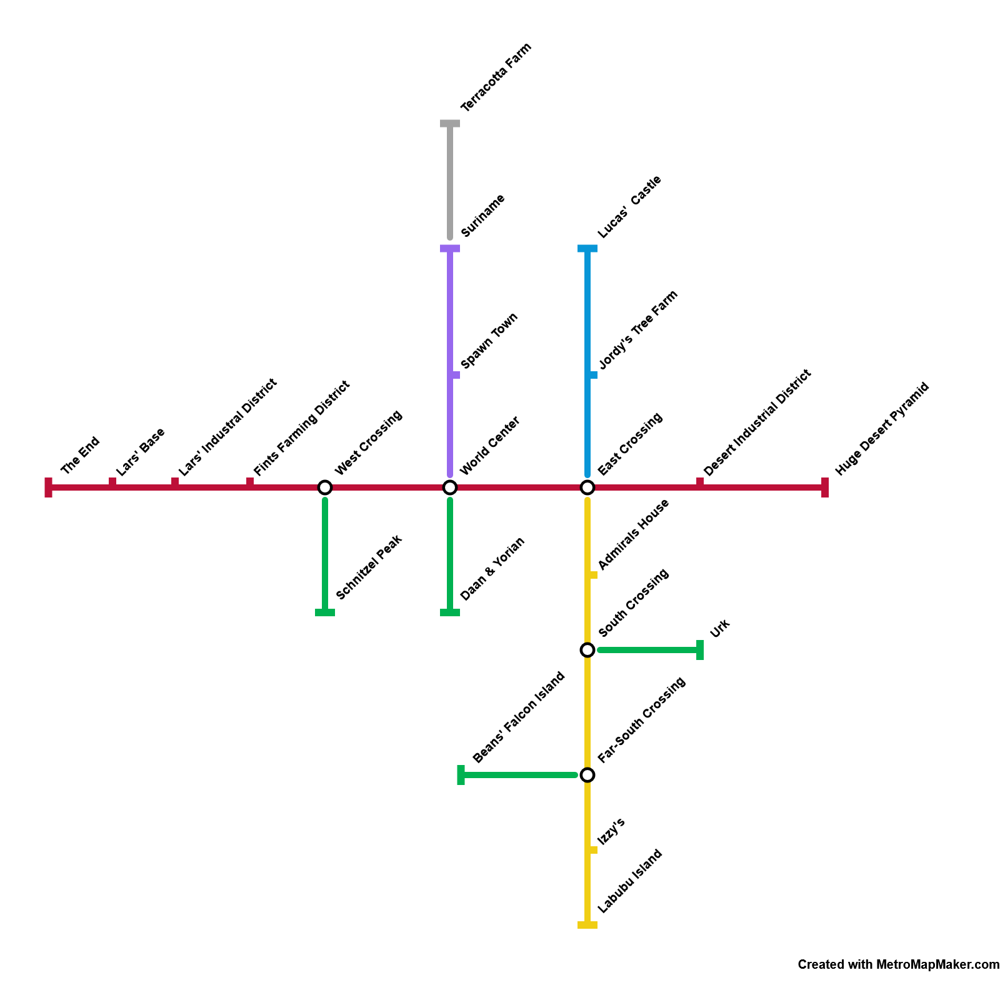

Since season 4 of [Helix Survival](/projects/helix-survival), the server has used a player-made metro system to travel around the world.
As minecarts are pretty slow in vanilla Minecraft (a max speed of 30km/h), a mod was used to increase their speed.

Due to how much this mod changed the behavior of minecarts, they did not work as expected for usecases other than transportation.
This led to the creation of **Flash Carts** as my own alternative to address these issues.

### The Issue
The reason the old mod did not work as well was because it used 'experimental minecart physics' for all carts, an option inside of Minecraft itself to enable a different physics engine for minecarts. This allowed carts to go way faster than vanilla minecarts, but also meant they behaved differently, which broke a lot of machines and farms dependent on this classic behavior.

### The Simple Solution
A simple way to solve this issue is to only use 'experimental minecart physics' for carts that need to go fast, and use the default physics engine for all other carts. 
Which in itself is a small and relatively simple change. 
Except for the fact that the new physics engine requires changes to the players client as it interprets movement differently (based on [LERP](https://en.wikipedia.org/wiki/Linear_interpolation)).
Which meant any cart using the old physics engine would look as if teleporting to clients expecting the new physics engine and vice versa.

### The Actual Solution
Finally, I solved the issue by implementing a translation layer that converts between the old and new physics engines.
When a minecart using the old physics engine needs to be communicated to the client, the translation layer converts its movement to the new physics engine's interpretation and sends this to the players clients. 

While not perfect, as the movement is inherently different between the two engines, it's accurate enough for most use cases and allows carts to behave as expected for use in automation.
