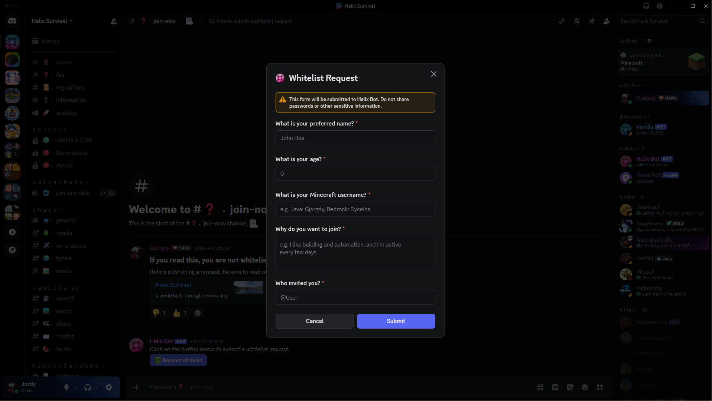
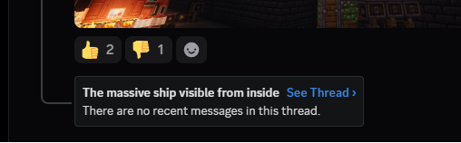
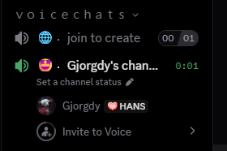

For communication regarding my Minecraft server we make use of Discord, a chat platform originally made for gamers.
Using Discords API you are able to create a bot that can interact with the platform.
In the case of Helix, the bot is used to automate various tasks on the server.

### Complexity
Normally, Discord bots are a great thing to build when learning to program. There are many libraries available on many different languages that make it very easy to interact with the Discord API.

I wanted to use this project to familiarize myself with more complicated APIs and creating tools, rather than just products. For this reason, 
I decided to write the bot without any Discord libraries, purely .NET with Newtonsoft for JSON parsing.

#### Rate Limiting
The biggest hurdle was the rate limiting imposed by Discord. They make use of a system called 'buckets' to limit the number of requests a bot can make. This system limits the number of requests within a certain context.

To handle this I used a registry to keep track of the rate limit buckets. With an 'intelligent' wait function that waits for the rate limit to reset if necessary.

<!--```csharp
namespace Core.Interfaces;

public interface IRateLimitRegistry
{
    public Task WaitIfNecessary(string resourceRoute);

    public void UpdateRateLimitBucket(string resourceRoute, string bucketId, int limit, int remaining,
        DateTime resetTime);
}
```-->

#### Disconnecting
Another issue I encountered was getting disconnected from the gateway, the websocket used to listen for events. 
As Discord is a massive platform, running widely distributed, disconnects are expected. 
The API does account for this, when a disconnection occurs, you can reconnect to a given gateway URL and using the same session ID.

This was sadly a function I did not account for when starting developing the bot which led to me having to rewrite my entire connection logic later on.

### Features

#### *Likes, Dislikes and Voting*
When a user or bot reacts to a message with a thumbs up or thumbs down emoji, the bot will add both emojis to the message and will prevent people from reacting both at the same time.
This allows for likes, dislikes and voting.

#### *Whitelist Requests*
The Minecraft server makes use of what's called a 'whitelist' to restrict access to players.
Only players on the whitelist are allowed to join the server.
For players to get added, they must first submit a request using the bot, making use of Discords form input.\
This request gets then send to a private channel with existing members where they can vote on whether to approve or deny the request.



#### *Gallery Channels*
When a channel gets marked as a gallery channel, the bot will filter every message and only allow media (images, videos, etc.) to be posted.
Every message sent will also get a thumbs up, thumbs down and chat bubble emoji added to it.

Clicking on the chat bubble emoji will remove it and create a 'thread' on this message, allowing users to reply and discuss the content.



#### *On-demand Voice Channels*
As the amount of voice channels needed is never the same, having a whole list of voice channels would be impractical.
Instead, the bot will automatically create a voice channel when a user joins the `join to create` channel and delete it when they leave.


