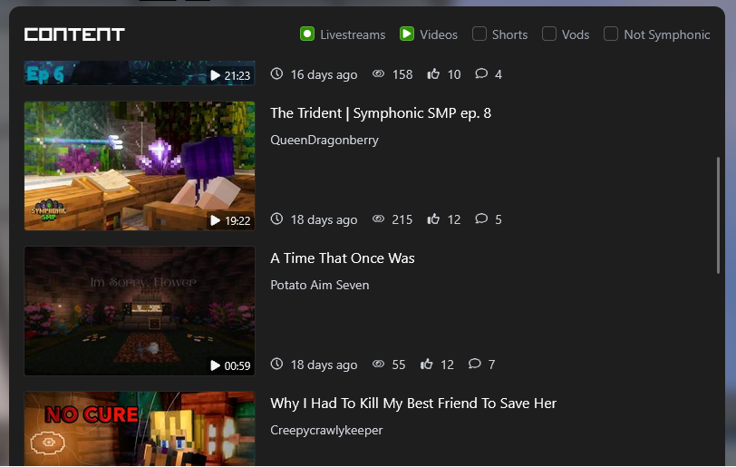

Symphonic SMP is a Minecraft server for content creators, specifically Twitch Streamers and YouTube creators.
It has a unique twist where every member is assigned a music disc from the game, which plays a role in the story they tell through their content.

I got into contact with some of the members after one of them contacted me regarding a Minecraft mod I made, [Sculk Radio](https://modrinth.com/mod/sculk-radio), that he wanted to use on the server.

A short time after this, I had some free time from school, I wanted to experiment with the [Svelte](https://svelte.dev/) framework as I did not have alot of experience with web frameworks at all before. From there this project took off and very quickly surpassed its initial scope.

### Use Case
The primary use case of the website is to be a place to easily find all content created by the server members on both Twitch and YouTube. 
By default, the website only shows content related to the server itself, but using the filters, users can also view unrelated content created by the members.

### Inspiration
The general layout and functionality of the website were heavily inspired by the [HermitCraft website](https://hermitcraft.com/), which is another Minecraft content creator server.

A repeated motive across the website are music discs, which are important to the server as described in the introduction. On the main page, all music discs are displayed in the header. Where on a member's profile page, only their assigned music disc is displayed.

### Technical Details
An on-demand time-out caching system is used to cache the content fetched from the Twitch and YouTube APIs. When a user enters the website, the back-end checks the age of the cached content and only refreshes it if it is older than a certain threshold.

Retrieving the content from YouTube was a bit more work than initially expected. 
YouTube enforces strict rate limiting on their API, which also differ per endpoint, which meant that I could not use endpoints like 'search' as it would have been way too expensive. Eventually I had to retrieve all video IDs using the playlist endpoint and then fetch the video details using a bulk request.
